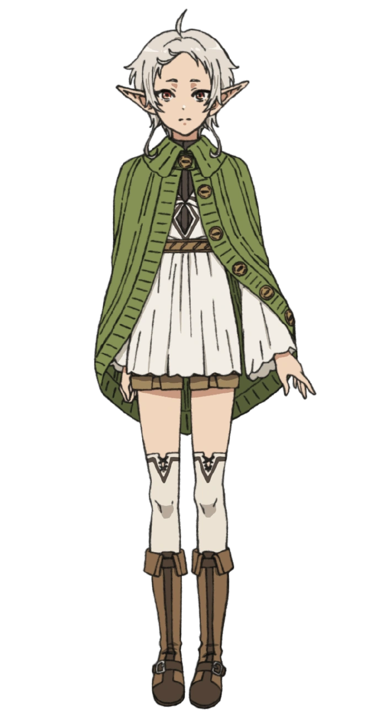

# Animator — Static Prototype → Animated Page

## Purpose

Convert a static retro newspaper prototype (from `prototype/*.html`) into an animated, interactive page using pure CSS `@keyframes` + vanilla JS. No libraries, no build steps — just a single HTML file.

## Rules

1. **Do NOT edit or overwrite the reference file** (`animate/sylphiette.html`). It is the canonical reference — never modify it.
2. **Output new files to the same folder as this skill file** (`animate/`). The result of applying this skill must be placed in `animate/`, not in `prototype/` or anywhere else.
3. **Copy images** from `prototype/{character}-img.png` into `animate/` as part of setup.

## Reference Implementation

File: `animate/sylphiette.html` — full working reference animated page. Do not edit.

The input prototype follows the structure defined in `prototype/layout-reference.html` (8 sections: A–H).

## Pattern Catalog

### 1. Atmosphere — Background & Particles

Replaces the flat body background with an animated gradient + floating particles that evoke the character's theme.

**CSS — Animated Gradient Background**
```css
body {
  background: linear-gradient(135deg, #2d4a38, #4a7c59, #6b9b7a);
  background-size: 400% 400%;
  animation: bgShift 12s ease infinite;
}
@keyframes bgShift {
  0%   { background-position: 0% 50%; }
  50%  { background-position: 100% 50%; }
  100% { background-position: 0% 50%; }
}
```

**CSS — Wind / Floating Particles**
```css
.wind-container { position: fixed; inset: 0; pointer-events: none; overflow: hidden; z-index: 0; }
.wind-particle {
  position: absolute; border-radius: 50%;
  animation: windDrift linear infinite; opacity: 0;
}
@keyframes windDrift {
  0%   { transform: translateX(0) translateY(0) scale(1); opacity: 0; }
  10%  { opacity: 1; }
  90%  { opacity: 0.8; }
  100% { transform: translateX(110vw) translateY(-40px) scale(1.5); opacity: 0; }
}
```

Particles are added via 8 static `<div class="wind-particle">` elements with randomized `nth-child` sizes/delays, plus a JS interval that spawns a new particle every 3s.

**CUSTOMIZE**: Replace color values in `linear-gradient` and `rgba()` to match the character's theme. To change particle shape from circles to leaves/sparks, swap `border-radius` or add a `clip-path`.

---

### 2. Page Entrance — Newspaper Container

The `.newspaper` container fades in and slides up on load.

```css
.newspaper {
  animation: paperFadeIn 1s ease-out;
}
@keyframes paperFadeIn {
  from { opacity: 0; transform: translateY(30px) scale(0.97); }
  to   { opacity: 1; transform: translateY(0) scale(1); }
}
```

**CUSTOMIZE**: Adjust `duration` (1s) and `translateY` distance.

---

### 3. Scroll Reveal — Section Entrance

Every major section has class `reveal`. On scroll, they fade+slide in when they enter the viewport.

**CSS**
```css
.reveal {
  opacity: 0; transform: translateY(30px);
  transition: opacity 0.7s ease, transform 0.7s ease;
}
.reveal.visible { opacity: 1; transform: translateY(0); }
```

**JS**
```javascript
const revealEls = document.querySelectorAll('.reveal');
const observer = new IntersectionObserver(function(entries) {
  entries.forEach(function(entry) {
    if (entry.isIntersecting) { entry.target.classList.add('visible'); }
  });
}, { threshold: 0.15, rootMargin: '0px 0px -30px 0px' });
revealEls.forEach(function(el) { observer.observe(el); });
// Mark above-fold as visible immediately
revealEls.forEach(function(el) {
  if (el.getBoundingClientRect().top < window.innerHeight * 0.85) {
    el.classList.add('visible');
  }
});
```

**CUSTOMIZE**: Adjust `threshold`, `rootMargin`, or `translateY` distance.

---

### 4. Typography Effects

#### 4a. EXTRA Banner Shimmer

A `::after` pseudo-element with a gradient sweeps across the "EXTRA" text.

```css
.extra-banner .extra-left { position: relative; overflow: hidden; }
.extra-banner .extra-left::after {
  content: ''; position: absolute; top: 0; left: -100%;
  width: 100%; height: 100%;
  background: linear-gradient(90deg, transparent, rgba(255,255,255,0.4), transparent);
  animation: shimmer 3s ease-in-out infinite;
}
@keyframes shimmer {
  0%   { left: -100%; }
  50%  { left: 100%; }
  100% { left: 100%; }
}
```

#### 4b. Headline Staggered Letter Reveal

The headline's key words are split into individual `<span class="letter">` elements. Each fades in with a staggered delay.

```css
.headline-main .letter {
  display: inline-block; opacity: 0;
  animation: letterFadeIn 0.5s ease forwards;
}
.headline-main .letter:nth-child(1) { animation-delay: 0.3s; }
.headline-main .letter:nth-child(2) { animation-delay: 0.4s; }
/* ... incrementing delays ... */
@keyframes letterFadeIn {
  from { opacity: 0; transform: translateY(10px); }
  to   { opacity: 1; transform: translateY(0); }
}
```

HTML structure:
```html
<div class="headline-main">
  <span class="accent letter">T</span><span class="letter">h</span><span class="letter">e</span>
  <span class="letter">W</span><span class="letter">i</span><span class="letter">n</span><span class="letter">d</span>
  <span class="letter"> </span>
  <span class="letter">H</span><span class="letter">e</span><span class="letter">r</span><span class="letter">o</span><br>
  Backend Course
</div>
```

#### 4c. Accent Word Pulse

The themed accent word (e.g. "The") glows softly.

```css
.headline-main .accent {
  animation: accentPulse 3s ease-in-out infinite;
}
@keyframes accentPulse {
  0%, 100% { text-shadow: 0 0 0 rgba(74,124,89,0); }
  50%      { text-shadow: 0 0 12px rgba(74,124,89,0.3); }
}
```

#### 4d. Decorative Line Grow

The `<div class="headline-wrap">::after` line animates from 0 to full width.

```css
.headline-wrap::after {
  animation: lineGrow 1.2s ease-out forwards;
  transform-origin: left;
}
@keyframes lineGrow {
  from { transform: scaleX(0); }
  to   { transform: scaleX(1); }
}
```

#### 4e. Dropcap Glow

The article's first letter pulses softly.

```css
.article .dropcap::first-letter {
  animation: dropcapGlow 2s ease-in-out infinite;
}
@keyframes dropcapGlow {
  0%, 100% { text-shadow: 0 0 0 rgba(74,124,89,0); }
  50%      { text-shadow: 0 0 8px rgba(74,124,89,0.2); }
}
```

#### 4f. Quote Typewriter

The quote text is typed out character by character when scrolled into view.

**HTML**
```html
<div class="quote-box" id="quoteBox">
  <span id="quoteText"></span><span class="cursor-blink" id="quoteCursor"></span>
</div>
```

**CSS**
```css
.quote-box .cursor-blink {
  display: inline-block; width: 2px; height: 1em; background: #4a7c59;
  margin-left: 2px; animation: blink 0.8s step-end infinite; vertical-align: text-bottom;
}
@keyframes blink { 0%, 100% { opacity: 1; } 50% { opacity: 0; } }
```

**JS**
```javascript
var quoteText = '"I believe in you. Let\'s grow together." \u2014 Sylphiette';
var quoteEl = document.getElementById('quoteText');
var cursorEl = document.getElementById('quoteCursor');
var idx = 0;
function typeChar() {
  if (idx < quoteText.length) {
    quoteEl.textContent += quoteText.charAt(idx);
    idx++;
    var delay = quoteText.charAt(idx - 1) === '.' || quoteText.charAt(idx - 1) === ',' ? 60 : 30;
    setTimeout(typeChar, delay);
  } else { cursorEl.style.display = 'none'; }
}
var quoteBox = document.getElementById('quoteBox');
var quoteObs = new IntersectionObserver(function(entries) {
  entries.forEach(function(entry) {
    if (entry.isIntersecting) { setTimeout(typeChar, 400); quoteObs.unobserve(entry.target); }
  });
}, { threshold: 0.3 });
quoteObs.observe(quoteBox);
```

**CUSTOMIZE**: Change `quoteText` and the color in `.cursor-blink`.

---

### 5. Interactivity

#### 5a. Character Image — 3D Parallax Tilt

On mousemove, the image tilts toward the cursor position.

**HTML**
```html
<div class="character-img-wrap" id="charWrap">
  
  <div class="char-tooltip">"Wind Hero • Greyrath's finest healer"</div>
</div>
```

**CSS**
```css
.character-box { perspective: 500px; }
.character-img-wrap { transition: transform 0.3s ease; transform-style: preserve-3d; }
.character-img-wrap:hover { transform: scale(1.05); }
.character-img { transition: filter 0.3s ease; cursor: pointer; }
.character-img:hover { filter: brightness(1.1) drop-shadow(0 4px 12px rgba(74,124,89,0.4)); }
```

**JS**
```javascript
var charWrap = document.getElementById('charWrap');
var charImg = document.getElementById('charImg');
charWrap.addEventListener('mousemove', function(e) {
  var rect = charWrap.getBoundingClientRect();
  var x = e.clientX - rect.left;
  var y = e.clientY - rect.top;
  var centerX = rect.width / 2;
  var centerY = rect.height / 2;
  var rotateX = ((y - centerY) / centerY) * -8;
  var rotateY = ((x - centerX) / centerX) * 8;
  charImg.style.transform = 'rotateX(' + rotateX + 'deg) rotateY(' + rotateY + 'deg) scale(1.05)';
});
charWrap.addEventListener('mouseleave', function() {
  charImg.style.transform = 'rotateX(0deg) rotateY(0deg) scale(1)';
});
```

**CUSTOMIZE**: Replace the tooltip text. Adjust `-8` and `8` for tilt sensitivity. Skip entirely if the prototype has no character image.

#### 5b. Character Image — Tooltip

A tooltip appears on hover below the image.

```css
.char-tooltip {
  position: absolute; bottom: -50px; left: 50%; transform: translateX(-50%);
  background: #2d4a38; color: #fff; padding: 0.4rem 0.8rem; border-radius: 6px;
  font-size: 0.7rem; white-space: nowrap; opacity: 0; pointer-events: none;
  transition: opacity 0.3s ease, bottom 0.3s ease;
}
.char-tooltip::after {
  content: ''; position: absolute; top: -6px; left: 50%; transform: translateX(-50%);
  border-left: 6px solid transparent; border-right: 6px solid transparent;
  border-bottom: 6px solid #2d4a38;
}
.character-img-wrap:hover .char-tooltip { opacity: 1; bottom: -56px; }
```

#### 5c. Character Name — Floating Emoji

The emoji in the character name bounces gently.

```css
.char-name .char-emoji {
  display: inline-block;
  animation: floatEmoji 2s ease-in-out infinite;
}
@keyframes floatEmoji {
  0%, 100% { transform: translateY(0); }
  50%      { transform: translateY(-5px); }
}
```

#### 5d. Curriculum — Hover & Click

Each curriculum item slides right on hover, reveals a lesson-count badge, and on click shows a toast.

**CSS**
```css
.curriculum-item {
  cursor: pointer; transition: background 0.3s ease, transform 0.2s ease, padding 0.3s ease;
}
.curriculum-item:hover {
  background: rgba(74,124,89,0.08); padding-left: 0.8rem; transform: translateX(4px);
}
.curriculum-item .lesson-badge {
  opacity: 0; transform: scale(0.8);
  transition: opacity 0.3s ease, transform 0.3s ease;
}
.curriculum-item:hover .lesson-badge { opacity: 1; transform: scale(1); }
.curriculum-item.active-lesson {
  background: rgba(74,124,89,0.15); border-left: 3px solid #4a7c59; padding-left: 0.8rem;
}
```

**JS — Toast**
```javascript
var toast = document.getElementById('curriculumToast');
document.querySelectorAll('.curriculum-item').forEach(function(item) {
  item.addEventListener('click', function() {
    var phaseName = item.querySelector('.phase').textContent;
    var lessons = item.getAttribute('data-lessons');
    toast.textContent = phaseName + ' \u2014 ' + lessons + ' lessons to mastery!';
    toast.classList.add('show');
    clearTimeout(toastTimeout);
    toastTimeout = setTimeout(function() { toast.classList.remove('show'); }, 2500);
    document.querySelectorAll('.curriculum-item').forEach(function(i) { i.classList.remove('active-lesson'); });
    item.classList.add('active-lesson');
  });
});
```

**HTML for each item**
```html
<div class="curriculum-item" data-lessons="4">
  <span class="phase">Phase 1</span> Database Fundamentals
  <span class="lesson-badge">4 lessons</span>
</div>
```

#### 5e. Hanko Stamp — Float & Click Burst

The hanko stamp floats gently. On click, it performs a scale burst.

```css
.hanko {
  cursor: pointer; user-select: none;
  animation: hankoFloat 4s ease-in-out infinite;
  transition: transform 0.3s ease, box-shadow 0.3s ease;
}
.hanko:hover { transform: rotate(0deg) scale(1.1); box-shadow: 0 0 20px rgba(139,0,0,0.3); }
.hanko.stamped { animation: stampBurst 0.5s ease; }
@keyframes stampBurst {
  0%   { transform: rotate(-8deg) scale(1); }
  30%  { transform: rotate(-8deg) scale(1.3); }
  60%  { transform: rotate(-8deg) scale(0.95); }
  100% { transform: rotate(-8deg) scale(1); }
}
@keyframes hankoFloat {
  0%, 100% { transform: rotate(-8deg) translateY(0); }
  50%      { transform: rotate(-8deg) translateY(-4px); }
}
```

**JS**
```javascript
var hanko = document.getElementById('hanko');
hanko.addEventListener('click', function() {
  hanko.classList.remove('stamped');
  void hanko.offsetWidth; // force reflow
  hanko.classList.add('stamped');
  setTimeout(function() { hanko.classList.remove('stamped'); }, 600);
});
```

#### 5f. Quote Box — Hover Border Shift

```css
.quote-box {
  transition: background 0.3s ease, border-color 0.3s ease;
}
.quote-box:hover {
  background: rgba(74,124,89,0.12); border-left-color: #8b0000;
}
```

#### 5g. CTA Button — Glow, Lift & Press

```css
.btn-start {
  transition: background 0.3s ease, transform 0.2s ease, box-shadow 0.3s ease;
  animation: ctaGlow 2s ease-in-out infinite;
}
.btn-start:hover {
  transform: translateY(-2px) scale(1.03);
  box-shadow: 0 6px 20px rgba(45,74,56,0.4);
  animation: none;
}
.btn-start:active { transform: translateY(0) scale(0.98); }
@keyframes ctaGlow {
  0%, 100% { box-shadow: 0 0 0 0 rgba(74,124,89,0.4); }
  50%      { box-shadow: 0 0 16px 4px rgba(74,124,89,0.25); }
}
```

---

### 6. Scroll Progress Bar

A thin fixed bar at the top of the viewport fills as the user scrolls.

**HTML** (immediately after `<body>`)
```html
<div class="scroll-progress" id="scrollProgress"></div>
```

**CSS**
```css
.scroll-progress {
  position: fixed; top: 0; left: 0; height: 3px; width: 0%;
  background: linear-gradient(90deg, #6b9b7a, #8b0000);
  z-index: 1000; transition: width 0.1s linear;
}
```

**JS**
```javascript
var progressBar = document.getElementById('scrollProgress');
window.addEventListener('scroll', function() {
  var scrollTop = window.pageYOffset || document.documentElement.scrollTop;
  var docHeight = document.documentElement.scrollHeight - window.innerHeight;
  var pct = docHeight > 0 ? (scrollTop / docHeight) * 100 : 0;
  progressBar.style.width = pct + '%';
});
```

## Conversion Workflow

```
Step 1 — Setup
  ├── Copy prototype/{character}.html → animate/{character}.html (output goes to this skill's folder)
  ├── Copy prototype/{character}-img.png → animate/
  └── Identify theme color from prototype CSS (e.g. #4a7c59)

Step 2 — Atmosphere
  ├── Replace flat body `background:` with animated gradient
  ├── Add `<div class="wind-container">` with 8 particles + keyframes
  └── Add JS spawnParticle interval

Step 3 — Scroll Reveal
  ├── Add `.reveal` CSS class block
  ├── Add `reveal` class to each section in HTML
  ├── Add IntersectionObserver JS block
  └── Add above-fold immediate visibility check

Step 4 — Page Entrance
  └── Add `.newspaper` animation + keyframes

Step 5 — Typography Effects
  ├── Split headline text into `<span class="letter">` elements
  ├── Add letterFadeIn keyframes + staggered nth-child delays
  ├── Add accentPulse on the accent word
  ├── Add shimmer on EXTRA
  ├── Add lineGrow on headline separator
  ├── Add dropcapGlow on article first-letter
  └── Add typewriter on quote box + cursor-blink

Step 6 — Interactivity
  ├── Add character image parallax tilt + tooltip
  ├── Add character name emoji float
  ├── Add curriculum hover (badge, slide) + click (toast, active state)
  ├── Add hanko float + click stamp burst
  ├── Add quote box hover border shift
  ├── Add CTA glow + hover lift + active press
  └── Add scroll progress bar

Step 7 — Responsive
  └── Verify mobile breakpoint (≤700px) handles all interactions
```

## Customization Guide

### Changing Theme Colors
All theme colors are declared directly in CSS selectors. Search for the color value (`#4a7c59` in Sylphiette) and replace everywhere, or use a `:root` approach:

```css
:root {
  --theme: #4a7c59;
  --theme-dark: #2d4a38;
  --theme-light: #6b9b7a;
  --accent: #8b0000;
  --paper: #f5f0e1;
}
```

### Changing Particle Type
- **Wind** (circles): Keep `border-radius: 50%`, white/green `rgba`
- **Leaves**: Add `clip-path: polygon(...)` or use a rotated oval shape
- **Sparks / Fire**: Amber/yellow `rgba`, smaller sizes, faster drift
- **Snow**: White circles, slower descent with `translateY(+100vh)` instead of `translateX`
- **Stars**: Tiny dots with `box-shadow` + twinkle keyframe

### Disabling Specific Patterns
Remove the corresponding HTML, CSS, and JS blocks:
- Particles: delete `.wind-container` HTML + related CSS + JS `spawnParticle` interval
- Typewriter: remove quote JS + keep static quote text
- Parallax tilt: skip the mousemove JS + keep static image
- Scroll progress: remove the progress bar HTML + CSS + JS

### Performance Notes
- Reduce particle count if the page feels sluggish (remove `nth-child` entries + increase `setInterval` spawn time)
- Remove `bgShift` animation on body for very long pages (it keeps the CPU active)
- All animations use `transform` and `opacity` only (GPU-composited properties)

## Assets

| File | Purpose |
|---|---|
| `animate/sylphiette.html` | Full working reference implementation |
| `animate/sylphiette-img.png` | Character image used by reference |
| `prototype/layout-reference.html` | Structural baseline (8-section wireframe) |
